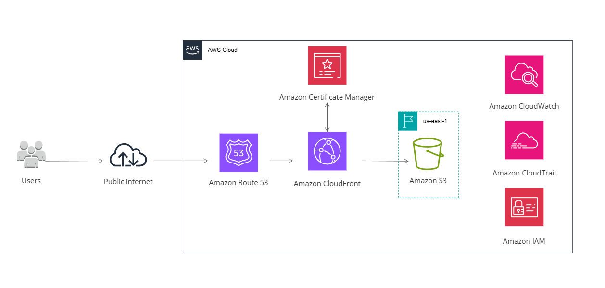

# aws-secure-static-web
This project builds a fully automated, secure, cost-optimized Static Web in AWS using Terraform

## AWS Services
The project leverages the following AWS services:

- **Amazon S3**: Stores the static website content in a private bucket with versioning enabled.  
- **Amazon CloudFront**: Distributes content globally with HTTPS support, custom domain aliases, and caching.  
- **AWS Certificate Manager (ACM)**: Issues and manages SSL/TLS certificates for custom domains.  
- **Amazon Route 53**: Manages DNS records for domain validation and mapping domains to the CloudFront distribution.  
- **CloudTrail**: Tracks API calls and changes in the AWS account for auditing.  
- **CloudWatch**: Collects metrics and logs for monitoring and alerting.

## Architecture

The website is designed to be **secure, fast, and globally available**. The architecture can be summarized as follows:

1. **S3 Bucket**  
   - Stores the website content (HTML, CSS, JS, images, etc.)  
   - Access is **private**; no public access is allowed  
   - Bucket versioning is enabled for safe rollbacks

2. **CloudFront Distribution**  
   - Serves content from the private S3 bucket  
   - Uses an **Origin Access Control (OAC)** to securely access the S3 bucket  
   - Provides HTTPS support using a certificate issued by ACM  
   - Custom domain aliases are configured

3. **AWS Certificate Manager (ACM)**  
   - Provides SSL/TLS certificate for the custom domain  
   - DNS validation is handled automatically via Route 53 records  

4. **Route 53 DNS**  
   - Creates temporary CNAME records for ACM validation  
   - Configures alias A records pointing the domain and subdomain to the CloudFront distribution
   - **Terraform automatically handles ACM DNS validation and CloudFront alias creation**, simplifying the process of securing and configuring your domain.

5. **CloudTrail and CloudWatch**  
   - CloudTrail captures API activity for auditing  
   - CloudWatch logs and metrics monitor CloudFront usage and errors  

## Architecture Diagram
Visual overview of the architecture:

*Diagram created using cacoo.com*

> The diagram shows the flow from the end user to CloudFront, then to the private S3 bucket, including HTTPS and domain validation.

## Note
This project assumes you have a registered domain and the corresponding hosted zone in Route 53. You can specify your domain name in **var.tf**.